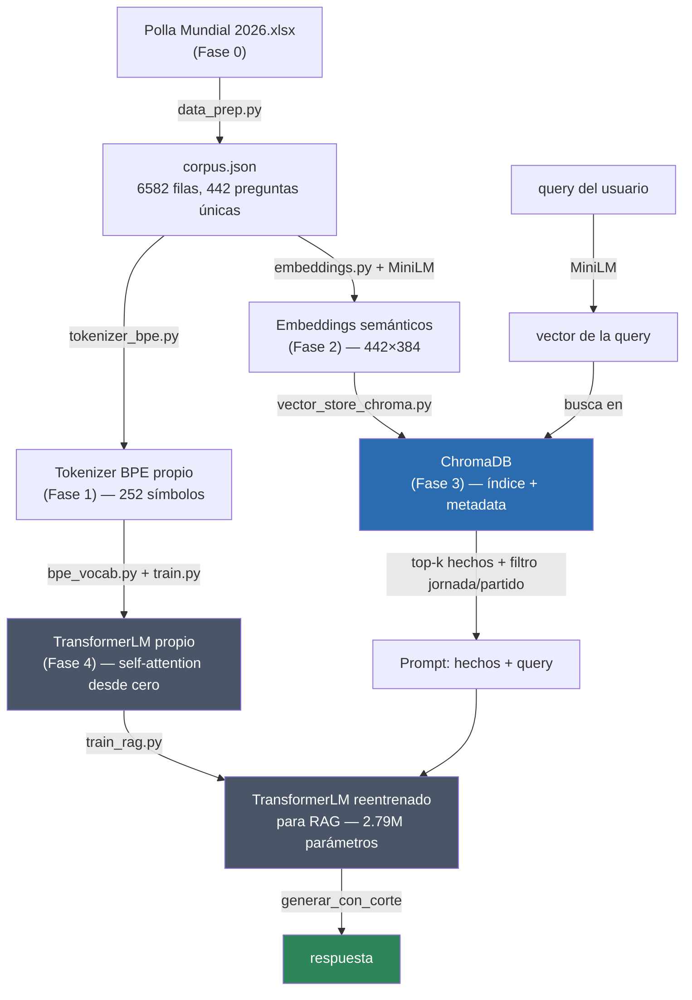

# IA Local desde Cero: LLM Propio + RAG

[](LICENSE)

Un LLM (transformer) entrenado **desde cero, sin modelos pre-entrenados**, y
un sistema **RAG** que lo usa como generador — todo corriendo 100% local en
una CPU doméstica. Proyecto formativo: cada fase está documentada para
enseñar el concepto, no solo para dejar el código funcionando.

El corpus son datos reales de la Polla Mundial 2026: preguntas y resultados
oficiales de un pool de predicciones del Mundial entre amigos.

> **Nota sobre los datos:** `data/` no se versiona en este repo (ver
> [`.gitignore`](.gitignore)) porque el corpus original contiene información
> personal de los participantes del pool. Para correr el pipeline completo
> hace falta tu propio archivo de datos en `data/raw/` con el mismo esquema
> que documenta [`docs/fase-0-setup-y-datos.md`](docs/fase-0-setup-y-datos.md#3-origen-de-los-datos)
> — el código es reutilizable con cualquier corpus de preguntas/respuestas
> con esa forma, no solo con datos de fútbol.

## Qué construye

1. Un **tokenizer BPE** propio (sin `tiktoken`/`sentencepiece`).
2. Un **transformer** propio en PyTorch puro (sin `transformers` de
   HuggingFace): self-attention, multi-head attention, positional encoding,
   causal masking, entrenado desde cero sobre el corpus.
3. Un **RAG**: retrieval semántico (MiniLM + ChromaDB) + generación con ese
   LLM propio, para que no dependa de haber memorizado todo el corpus en sus
   ~2.8M parámetros.

Todo pensado para hardware muy modesto: modelo pequeño (~1-10M parámetros),
contexto corto (64-128 tokens), pocas capas — ver
[`PROYECTO_BASE.md`](PROYECTO_BASE.md) para el detalle de las restricciones
y el roadmap completo.


## Arquitectura del pipeline



MiniLM y ChromaDB **buscan**, nunca generan; el `TransformerLM` propio es la
única pieza que **genera** texto. Ver [`docs/fase-5-rag.md`](docs/fase-5-rag.md)
para el detalle completo del pipeline de RAG.

## Quickstart

```bash
# 1. Clonar e instalar dependencias (uv genera el venv y respeta uv.lock)
uv sync

# 2. Correr el pipeline completo, fase por fase (cada script deja su
#    artefacto en data/processed/, consumido por la fase siguiente)
./.venv/Scripts/uv.exe run python src/data_prep.py        # Fase 0: corpus.json
./.venv/Scripts/uv.exe run python src/tokenizer_bpe.py    # Fase 1: vocabulario BPE
./.venv/Scripts/uv.exe run python src/embeddings.py       # Fase 2: embeddings MiniLM
./.venv/Scripts/uv.exe run python src/vector_store_chroma.py  # Fase 3: índice Chroma
./.venv/Scripts/uv.exe run python src/train.py             # Fase 4: entrena el LLM propio
./.venv/Scripts/uv.exe run python src/train_rag.py         # Fase 5: reentrena para RAG

# 3. Preguntar (CLI)
./.venv/Scripts/uv.exe run python src/rag.py "¿quién gana el Partido 3 de la jornada 3?"

# 3b. O con la UI mínima (Streamlit)
./.venv/Scripts/uv.exe run streamlit run src/app.py

# Correr toda la suite de tests
./.venv/Scripts/uv.exe run pytest -q
```

## Roadmap por fases

| Fase | Qué se aprende | Documentación técnica | Notas del tutor |
|---|---|---|---|
| 0 — Setup y datos | Estructura de repo, entorno reproducible (`uv`), diagnóstico de encoding, normalización del corpus | [`docs/fase-0-setup-y-datos.md`](docs/fase-0-setup-y-datos.md) | [`docs/tutor/fase-0-tutor.md`](docs/tutor/fase-0-tutor.md) |
| 1 — Tokens | Tokenización char-level vs. BPE (subword), el algoritmo de fusión de pares implementado a mano | [`docs/fase-1-tokens.md`](docs/fase-1-tokens.md) | [`docs/tutor/fase-1-tutor.md`](docs/tutor/fase-1-tutor.md) |
| 2 — Embeddings | De tokens a vectores semánticos, similitud coseno, modelos pre-entrenados (`all-MiniLM-L6-v2`) | [`docs/fase-2-embeddings.md`](docs/fase-2-embeddings.md) | [`docs/tutor/fase-2-tutor.md`](docs/tutor/fase-2-tutor.md) |
| 3 — Vector Database | ANN (approximate nearest neighbor), FAISS, ChromaDB, filtros por metadata | [`docs/fase-3-vector-database.md`](docs/fase-3-vector-database.md) | [`docs/tutor/fase-3-tutor.md`](docs/tutor/fase-3-tutor.md) |
| 4 — LLM propio | Arquitectura transformer completa desde cero: self-attention, causal masking, entrenamiento | [`docs/fase-4-llm-propio.md`](docs/fase-4-llm-propio.md) | [`docs/tutor/fase-4-tutor.md`](docs/tutor/fase-4-tutor.md) ([desglose por concepto](docs/tutor/fase-4/00-panorama.md)) |
| 5 — RAG completo | Integración retrieval + generación, reentrenamiento para anclar el LLM al contexto inyectado | [`docs/fase-5-rag.md`](docs/fase-5-rag.md) | [`docs/tutor/fase-5-tutor.md`](docs/tutor/fase-5-tutor.md) |
| 6 — Portafolio | Este README, diagrama de arquitectura, UI mínima (`src/app.py`) — sin doc técnico propio, ver más abajo | — | — |

Los `docs/fase-N-*.md` documentan **qué se construyó y por qué** (decisiones
de diseño, resultados reales, comandos). Los `docs/tutor/fase-N-tutor.md`
son la explicación **conceptual** dada durante la construcción de esa fase
— útiles si estás aprendiendo del repo, no solo leyendo el código.

## Decisiones técnicas clave

- **Transformer desde cero, sin `transformers` de HuggingFace** — el
  objetivo es entender self-attention por dentro (verificado a mano,
  número por número, contra la salida real del código), no solo usarlo
  como caja negra.
- **Embeddings sí pre-entrenados (`all-MiniLM-L6-v2`)** — entrenar
  embeddings desde cero necesita miles de millones de pares de oraciones,
  inviable con 442 preguntas únicas y hardware doméstico; ver
  [`docs/fase-2-embeddings.md`](docs/fase-2-embeddings.md#1-qué-es-un-embedding-y-por-qué-no-es-lo-mismo-que-un-token-id).
- **Reentrenamiento específico para RAG** (`train_rag.py`) — el LLM
  entrenado en Fase 4 (oraciones sueltas) ignoraba el contexto inyectado en
  producción; hubo que reentrenar con un dataset sintético con la misma
  forma "contexto + pregunta" que usa RAG en runtime. Ver
  [`docs/fase-5-rag.md`](docs/fase-5-rag.md#2-reentrenamiento-para-rag-srctrain_ragpy).
- **Filtro por metadata antes que solo similitud semántica** — con un
  corpus de estructura muy repetida, la búsqueda semántica pura falla en
  queries con número explícito ("Partido 3"); se combina con un filtro
  exacto de ChromaDB (`where`) extraído por regex de la query.

## Límites conocidos

- El LLM propio (unos pocos millones de parámetros) no tiene un mecanismo
  de atención dirigida/copia confiable: cuando el contexto trae varias
  líneas casi idénticas en estructura, puede copiar el dato de la línea
  equivocada. Es una limitación de arquitectura (no de datos/capacidad),
  documentada en detalle en
  [`docs/fase-5-rag.md`](docs/fase-5-rag.md#4-límite-central-de-la-fase-honesto-no-resuelto).
- Sin *entity linking*: una query que menciona un equipo sin número de
  partido/jornada ("¿qué tal jugó Colombia?") no se beneficia del filtro de
  metadata.
- Generación sin KV-caching (recalcula toda la secuencia en cada token
  nuevo) — fuera de alcance para un proyecto educativo a esta escala.

## Estructura del repo

```
IA-tech/
├── data/
│   ├── raw/          # datos originales, intocables (no versionado, ver arriba)
│   └── processed/    # artefactos generados por los scripts (regenerable)
├── src/               # código fuente de cada fase
├── tests/             # pruebas automatizadas (pytest)
├── docs/               # documentación por fase + notas de tutor
├── notebooks/          # exploración interactiva
├── LICENSE             # MIT
└── pyproject.toml      # dependencias (gestionadas con uv)
```

## Licencia

[MIT](LICENSE) — libre para usar, copiar, modificar y distribuir, con solo
mantener el aviso de copyright.
